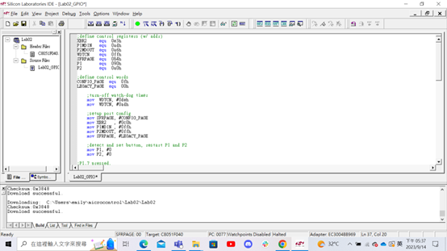
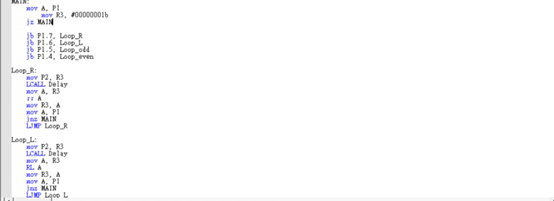

# Microcontroller Experiment Lab02 Report
- [Microcontroller Experiment Lab02 Report](#microcontroller-experiment-lab02-report)
  - [Problem Description](#problem-description)
    - [Goal of Lab02](#goal-of-lab02)
  - [Code \& Explanation](#code--explanation)
    - [Part 1 - Pin Define](#part-1---pin-define)
    - [Part 2 - Main Loop](#part-2---main-loop)
    - [Part 3 - Loop Right \& Left](#part-3---loop-right--left)
    - [Part 4 - Delay](#part-4---delay)
  - [Difficulties Encountered and Solutions](#difficulties-encountered-and-solutions)
  - [Disscussion](#disscussion)
## Problem Description
### Goal of Lab02
+ To learn how a program affects hardware signals
+ To send/receive signals from an application processor to external devices through I/O pads
+ Design your own LED box
  + initial all LED off
  + The LED run certain pattern after some button pressed
  + At least 4 different patterns
  + you can design your own pattern

## Code & Explanation
Full code
```arm
;define control registers (w/ addr)
XBR2     equ  0e3h
P1MDIN   equ  0adh
P2MDOUT  equ  0a6h
WDTCN    equ  0ffh
SFRPAGE  equ  084h
P1       equ  090h
P2       equ  0a0h

;define control words
CONFIG_PAGE  equ  0fh
LEGACY_PAGE  equ  00h

    ;turn-off watch-dog timer
    mov  WDTCN, #0deh
    mov  WDTCN, #0adh

    ;setup port config
    mov SFRPAGE, #CONFIG_PAGE
    mov XBR2   , #0c0h
    mov P1MDIN , #0ffh
    mov P2MDOUT, #0ffh
    mov SFRPAGE, #LEGACY_PAGE

		;detect and set button, restart P1 and P2
		mov P1, #0
		mov P2, #0

;P1.7 pressed,
MAIN:
		mov A, P1
        mov R3, #00000001b
		jz MAIN

    jb P1.7, Loop_R

		jb P1.6, Loop_L

		jb P1.5, Loop_odd

		jb P1.4, Loop_even

Loop_R:
    mov P2, R3
    LCALL Delay
    mov A, R3
    rr A
    mov R3, A
    mov A, P1
    jnz MAIN
    LJMP Loop_R

Loop_L:
    mov P2, R3
    LCALL Delay
    mov A, R3
    RL A
    mov R3, A
    mov A, P1
    jnz MAIN
    LJMP Loop_L

Loop_odd:
    mov P2, #10101010b
    LCALL Delay
    mov P2, #00000000b
    LCALL Delay
    mov A, P1
    jnz MAIN
    LJMP Loop_odd

Loop_even:
    mov P2, #01010101b
    LCALL Delay
    mov P2, #00000000b
    LCALL Delay
    mov A, P1
    jnz MAIN
    LJMP Loop_even

Delay: MOV R0, #50
Delay0: MOV R1, #40
Delay1: MOV R2, #249
Delay2: DJNZ R2, Delay2
        DJNZ R1, Delay1
        DJNZ R0, Delay0
        RET
END
```

<div style="break-after: page; page-break-after: always;"></div>



### Part 1 - Pin Define
```arm
;define control registers (w/ addr)
XBR2     equ  0e3h
P1MDIN   equ  0adh
P2MDOUT  equ  0a6h
WDTCN    equ  0ffh
SFRPAGE  equ  084h
P1       equ  090h
P2       equ  0a0h

;define control words
CONFIG_PAGE  equ  0fh
LEGACY_PAGE  equ  00h

    ;turn-off watch-dog timer
    mov  WDTCN, #0deh
    mov  WDTCN, #0adh

    ;setup port config
    mov SFRPAGE, #CONFIG_PAGE
    mov XBR2   , #0c0h
    mov P1MDIN , #0ffh
    mov P2MDOUT, #0ffh
    mov SFRPAGE, #LEGACY_PAGE

		;detect and set button, restart P1 and P2
		mov P1, #0
		mov P2, #0
```
We define the port I/O for `P1MDIN` and `P2MDOUT`, so that `P1` is input and `P2` can output to LED and also store them in `P1` and `P2`.
Then we define the control page and setup the port config to set the `P1` and `P2` to detect buttons. Set the port settings as the manual said.

<div style="break-after: page; page-break-after: always;"></div>

### Part 2 - Main Loop
```arm
;P1.7 pressed,
MAIN:
		mov A, P1
        mov R3, #00000001b
		jz MAIN
    
    jb P1.7, Loop_R

		jb P1.6, Loop_L

		jb P1.5, Loop_odd

		jb P1.4, Loop_even
```
We make the `MAIN` as the begining of the program, and it'll continue to stay at `MAIN` until a button is pressed, and also reset the value of `R3`, which we set as the LED pattern status stored at phase Loop Right or Left.
After button pressed, it'll just jump to the flag which correspond to the action, such as `Loop_R` when we want to Loop right and pressed button P1.7. The correspond relation is shown as table below.
|flag|LED pattern|button|
|:--|:--|:--|
|`Loop_R`|loop right|P1.7|
|`Loop_L`|loop left|P1.6|
|`Loop_odd`|blink odd LED|P1.5|
|`Loop_even`|blink even LED|P1.4|

<div style="break-after: page; page-break-after: always;"></div>

### Part 3 - Loop Right & Left
```arm
Loop_R:
    mov P2, R3
    LCALL Delay
    mov A, R3
    rr A
    mov R3, A
    mov A, P1
    jnz MAIN
    LJMP Loop_R

Loop_L:
    mov P2, R3
    LCALL Delay
    mov A, R3
    RL A
    mov R3, A
    mov A, P1
    jnz MAIN
    LJMP Loop_L

Loop_odd:
    mov P2, #10101010b
    LCALL Delay
    mov P2, #00000000b
    LCALL Delay
    mov A, P1
    jnz MAIN
    LJMP Loop_odd

Loop_even:
    mov P2, #01010101b
    LCALL Delay
    mov P2, #00000000b
    LCALL Delay
    mov A, P1
    jnz MAIN
    LJMP Loop_even
```
After jump into the loop, it'll stay in the loop until another button is pressed in `P1`. By the `jnz MAIN`, we'll jump back to `MAIN` when `P1` isn't zero, so we can create this function.
Besides the check function to jump back to `MAIN` at the end of loop, we'll shift the LED by 1 slot every blink, using the `rr`/`rl` instruction and the call of `Delay`, which will paused for about 1 second.
For `Loop_even` and `Loop_odd`, the `jnz MAIN` part is the same, but we make it to light all odd/even and then go whole dark, each stays for roughly 1 second, using `Delay`.

### Part 4 - Delay
```arm
Delay: MOV R0, #50
Delay0: MOV R1, #40
Delay1: MOV R2, #249
Delay2: DJNZ R2, Delay2
        DJNZ R1, Delay1
        DJNZ R0, Delay0
        RET
END
```
This is th code given by the teacher, which is equivalent to the follwing C code, a three layer nested for loop. It will delay the instruction for approximately 1 second.
```cpp
for (i = 50; i > 0; i--) {
  for (j = 40; j > 0; j--) {
    for (k = 249; j > 0; j--){
    }
  }
}
```

## Difficulties Encountered and Solutions
At first we have trouble at understanding how to set to P1, P2, ports, and also have no idea where to start. After we asked teacher, we realize that the given code has already setup all the defination for P1, P2 and watchdog timer, and understand how ports I/O was done in assembly. We also see the `Config_Page` and `Legacy_Page`, we thought that it was the page in the manual, so we have no idea what it does and why it's here. Why save the page in manual into the code? After asking teacher, we realize that the page is a concept in memory, not the page we understand in real life.
Later we faced another problem, we've no idea how to make the condition jump for each button pressed. After long thinking and trying, and experiment with the example code several time, we've done it by jump at `MAIN`, and by using the bit-addressable register `P1` with `jb` instruction, we successfully made the conditional jump.
But then we occured our final problem, how to get the loop back to `MAIN` after button was pressed to proceed conditional jump? We then thought that by detect if `P1` is zero in the loop every loop cycle, so we'll jump back after `P1` is changed. However, the code still dies. After debugging, we find is that our register `A` was used by our LED shifting and also `jb` branch, so the value in both will conflict causing error. We resolved by store LED status in `R3`, so everytime `A` was used, it'll pull value to `A` and store back so `A` won't conflict together.

<div style="break-after: page; page-break-after: always;"></div>

## Disscussion
After this Lab, I've understand more about how I/O work in computer, and how we done it in assembly code. Using code to setup our flow, and knowing how to setup the config for the ports, I/O. And successful to let our board the blink LED's as we want.
Also, I've learned more about the way to write assembly, as some register is been specify and required additional step to make it work. Such as `A`, we must use other register to store our value to revent confrontation between our code. Conditional jump also understand more, as this code require to use `jb`. With the use of bit-addressable register, I've realized more about the advantage and disadvantage of assembly with 8051 board.
Hope our next lab is successful too.